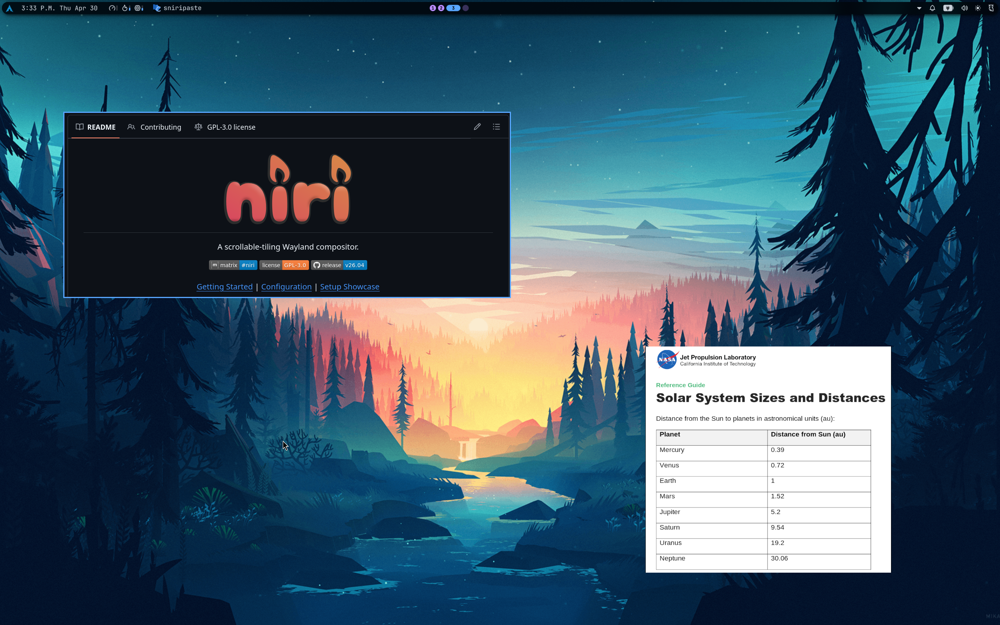

# Osnip

**Pin a screenshot to your screen.** A [Snipaste](https://www.snipaste.com/)-style
screen pinning tool for wlroots-style Wayland compositors, with a native
[Omarchy](https://omarchy.org/) bar plugin.

Press a hotkey, drag a region, and the captured pixels stay floating on top
while you work. The bar shows how many pins are live; the panel shows what
they are.



## Why

Reference a diagram while writing code. Compare two designs side-by-side. Keep
an error message visible while you fix it. Pin the clipboard image without
saving a file.

## Features

**Pinning**

- **Region capture** — drag-to-select via `slurp`, pin the result.
- **Clipboard pin** — pin whatever image is on your clipboard.
- **Multi-pin** — as many floating windows as you want, each independently closeable.
- **Stays out of the way** — pins live in the compositor's floating layer, above your tiled windows.
- **Per-workspace** — a pin opens on the workspace you captured from and stays there.
- **Edits stack** — rotate then flip operates on the latest pixels, not the original capture.

**In the Omarchy bar**

- **Live pin count.** The icon carries a badge and dims when nothing is
  pinned. It updates the instant a pin opens or closes — the panel holds a
  subscription to the daemon rather than polling.
- **Thumbnails of every pin**, with dimensions and age.
- **Per-pin actions without hunting for the window** — close, copy, save,
  rotate, flip, on any pin, focused or not, on any workspace.
- **The capture verbs one click away** — capture a region, pin the clipboard,
  close everything.

## Install

### Omarchy

One command. The plugin installs the daemon for you if it is missing:

```fish
omarchy plugin add https://github.com/FGranda2/Osnip.git --enable
```

Then open the panel from the bar icon; if the daemon is absent it offers
**Install the osnip daemon**, which opens an Omarchy terminal running
`omarchy pkg aur add osnip`. The install runs where you can watch it on
purpose: plugins are unsandboxed code inside your long-lived `omarchy-shell`
process, and one should never acquire privileges out of sight.

Omarchy already ships `slurp`, `wl-clipboard`, and `libnotify`.

### Arch

```fish
omarchy pkg aur add osnip     # or: yay -S osnip
```

### Build from source

Requires Rust stable, a Wayland session on a compositor that implements
`zwlr_screencopy_v1`, and `slurp` + `wl-clipboard`. `libnotify` (for
`notify-send`) is optional but recommended — without it, copy/save still work
but produce no desktop toast.

```fish
cargo build --workspace --release
install -Dm755 target/release/osnip        ~/.local/bin/osnip
install -Dm755 target/release/osnip-daemon ~/.local/bin/osnip-daemon
```

## Usage

### From the bar

**Left-click** the icon opens the panel · **right-click** captures a region ·
**middle-click** pins the clipboard image.

In the panel: **arrow keys** move between pins, **Enter** copies the selected
one, **Delete** closes it, **Esc** dismisses the panel.

### From the CLI

```fish
osnip capture       # drag a region, get a pin
osnip clipboard     # pin the clipboard image
osnip list          # show every live pin
osnip close <id>    # close one pin
osnip close-all     # close every pin
```

### On a focused pin window

| Key       | Action                                  |
| --------- | --------------------------------------- |
| `Ctrl+C`  | Copy the pin's pixels to the clipboard  |
| `Ctrl+S`  | Save as PNG to the configured directory |
| `]` / `[` | Rotate 90° clockwise / counter-clockwise|
| `H` / `V` | Flip horizontal / vertical              |

Copy and save trigger a desktop notification via `notify-send`; rotate and
flip update the window in place.

## Hyprland window rules and hotkey

A shell plugin cannot write Hyprland config, so this stays a one-time manual
step. Omarchy configures Hyprland in Lua, and user files load after Omarchy's
defaults — drop the snippet in as its own module and require it last:

```fish
install -Dm644 contrib/omarchy/osnip.lua ~/.config/hypr/osnip.lua
echo 'require("hypr.osnip")' >> ~/.config/hypr/hyprland.lua
hyprctl reload; and hyprctl configerrors
```

The snippet floats every `osnip-pin` window, forces it opaque, and binds
capture to **Super+Shift+S**. The opacity rule matters more than it looks:
Omarchy renders every window at `0.985 0.96`, and a screenshot that blends
with what is behind it is not a reference any more. Super+Shift+S ships bound
to the Google Maps web app, so the snippet unbinds it first; Google Maps is
still one `Super+Space` away.

See [`contrib/omarchy/osnip.lua`](contrib/omarchy/osnip.lua) for the
commented-out extras: corner anchoring, borderless pins, opening pins without
stealing focus, and making pins follow you across workspaces instead of
staying put.

Everything else — capture, clipboard, close all — is in the panel, so the
hotkey is optional.

### Niri

```fish
sudo pacman -S slurp wl-clipboard libnotify
```

Append [`contrib/niri/config-snippet.kdl`](contrib/niri/config-snippet.kdl) to
`~/.config/niri/config.kdl` — Niri reloads it automatically. Press
**Mod+Shift+S**, drag, and a pin appears. (The bar plugin is Omarchy-only;
everything else works here.)

## Configuration

### Daemon

Optional. Drop a TOML file at `~/.config/osnip/config.toml`:

```toml
save_dir = "~/Pictures/osnip"
filename_template = "osnip-{timestamp}.png"
```

Both fields are optional; missing fields fall back to the defaults shown. The
`{timestamp}` token expands to local time as `YYYYMMDD-HHMMSS`.

### Bar widget

| Setting | Default | What it does |
|---|---|---|
| `showCountBadge` | `On` | Overlay the live pin count on the bar icon |
| `thumbnailColumns` | `3` | Previews per row in the panel (1–5) |

```fish
omarchy bar set io.github.franciscogranda.osnip thumbnailColumns 4
omarchy bar move io.github.franciscogranda.osnip --section right
```

## Repository layout

One repo, two halves. `manifest.json` sits at the root because
`omarchy plugin add` clones a repo *directly* into
`~/.config/omarchy/plugins/<id>/` and looks for the manifest there — so the
plugin has to be the repo, not a subdirectory of it.

```
manifest.json      plugin manifest — must stay at the root
BarWidget.qml      bar icon and pin-count badge
Panel.qml          the panel: thumbnails, per-pin actions, capture verbs
Model.js           all plugin logic, kept out of QML so it can be unit-tested
tests/             node --test suite for Model.js
crates/
  osnip-core/      shared IPC types and wire framing
  osnip-daemon/    pin windows, capture, clipboard, thumbnails, the socket
  osnip-cli/       the `osnip` command
contrib/           Hyprland and Niri snippets, systemd user unit
PKGBUILD           the `osnip` AUR package
```

The Rust source rides along into the plugin directory when installed, which
is harmless — the shell only ever loads what `entryPoints` names. **Do not
build inside the installed copy**, though: the shell hot-reloads plugin code
whenever a file under `~/.config/omarchy/plugins/` changes, and a `target/`
directory there would trigger a reload storm. Build from a separate clone.

## How the bar talks to the daemon

The panel holds one long-lived Unix socket connection and subscribes to it.
The daemon pushes a full pin snapshot on every change — new pin, closed pin,
rotate, flip — so the bar reflects reality without a timer anywhere in the
plugin, and a client cannot desynchronize.

Thumbnails are PNGs the daemon writes under `$XDG_RUNTIME_DIR/osnip/`, so
previews never travel through the socket. Each pin carries a revision that
bumps on every transform, which is what stops Qt from serving pre-rotation
pixels out of its image cache.

`Capture` and `Clipboard` shell out to the `osnip` CLI rather than using the
socket, because the CLI auto-spawns the daemon — they work from a cold start,
where a socket write would simply fail.

<details>
<summary><b>IPC protocol</b></summary>

The daemon serves two framings on one socket and selects between them using
the first byte of each connection:

| First byte | Transport | Client |
|------------|-----------|--------|
| `0x00` | length-prefixed JSON, one request then close | the `osnip` CLI |
| `{` | newline-delimited JSON, connection held open | the bar plugin |

This is unambiguous rather than a guess: frames are capped at 1 MiB and the
cap is enforced before allocation, so the high byte of a valid length prefix
is always `0x00` and can never collide with `{`.

An NDJSON connection opens with a `hello` line carrying the protocol version
and the daemon's capabilities. `{"kind":"subscribe"}` turns the connection
into an event stream.

```console
$ printf '{"kind":"subscribe"}\n' | socat - UNIX-CONNECT:$XDG_RUNTIME_DIR/osnip.sock
{"kind":"hello","protocol":2,"version":"0.2.0","capabilities":["subscribe","pin_action","thumbnails"]}
{"kind":"ok"}
{"kind":"event","event":"pins_changed","pins":[]}
```

`{"kind":"pin_action","id":3,"action":"rotate_right"}` applies any of the six
keyboard actions (`copy`, `save`, `rotate_right`, `rotate_left`, `flip_h`,
`flip_v`) to a pin without focusing its window.

</details>

<details>
<summary><b>Optional: run the daemon as a systemd user service</b></summary>

```fish
install -Dm644 contrib/osnip-daemon.service \
               ~/.config/systemd/user/osnip-daemon.service
pkill -f osnip-daemon; or true
systemctl --user daemon-reload
systemctl --user enable --now osnip-daemon.service
```

If the unit fails with `WAYLAND_DISPLAY is unset`, import the session env once:

```fish
systemctl --user import-environment WAYLAND_DISPLAY XDG_RUNTIME_DIR XDG_CURRENT_DESKTOP
systemctl --user restart osnip-daemon.service
```

Logs: `journalctl --user -f -u osnip-daemon.service`

On Omarchy the equivalent is `o.launch_on_start("osnip-daemon")` in the Lua
snippet, which scopes the daemon under uwsm like everything else in the
session. Pick one, not both. Either is worth it with the bar plugin, which
can only show a live pin count while the daemon is up.

</details>

<details>
<summary><b>Environment variables</b></summary>

- `OSNIP_SOCKET` — override the daemon socket path, honored by both the
  daemon and the CLI. Each daemon keeps its thumbnails in a directory named
  after its socket, so two daemons on two sockets do not collide.
- `OSNIP_SAVE_DIR` — write every capture to `<dir>/pin-<id>.png`.
- `OSNIP_SLURP_ARGS` — replace the default `slurp` argument list.
- `RUST_LOG` — daemon verbosity (default `info`).

</details>

## Staying up to date

Omarchy installs plugins as git checkouts and never pulls them, so updates
are explicit:

```fish
omarchy plugin update io.github.franciscogranda.osnip
omarchy restart shell
```

The restart is not optional after an update: a plugin rescan does not
re-execute QML the shell has already loaded. Updating the daemon is separate
(`omarchy pkg aur add osnip`), and the running daemon keeps the old binary
until it is restarted or the session ends.

To remove the plugin: `omarchy plugin remove io.github.franciscogranda.osnip`.
That leaves the daemon and your saved screenshots alone.

## Development

```fish
cargo test --workspace           # daemon, CLI, and protocol
cargo clippy --workspace --all-targets
node --test tests/model.test.js  # plugin logic
omarchy plugin validate .        # the same checks the installer runs
```

`Model.js` holds every pure function the plugin needs — protocol framing,
state folding, label formatting, command construction — precisely so it can
be tested outside QML. The `.qml` files draw; they do not decide. A plugin
runs unsandboxed inside the shell process, so an uncaught exception in a
delegate degrades the whole bar.

To try a local checkout without going through git:

```fish
mkdir -p ~/.config/omarchy/plugins/io.github.franciscogranda.osnip
cp manifest.json Model.js *.qml ~/.config/omarchy/plugins/io.github.franciscogranda.osnip/
omarchy-shell shell rescanPlugins
omarchy plugin enable io.github.franciscogranda.osnip --section right
omarchy restart shell
```

Watch for QML errors with `journalctl --user -f` while the shell starts.

## Status

Capture, clipboard pin, multi-window rendering, thumbnails, and both IPC
transports work end-to-end on Hyprland (Omarchy) and Niri. Nothing in the
binaries is compositor-specific — everything that is lives in `contrib/` and
in the bar plugin — so the daemon should also work on any other wlroots
compositor implementing `zwlr_screencopy_v1`.

**Not yet:** annotations, OCR, color picker.

**Known limitations:**

- Pins on scaled monitors render at physical-pixel size.
- Pins hide behind focused fullscreen windows — intentional in Niri's
  floating-layer design, and true of any plain floating window on Hyprland.
  On Hyprland you can trade this away: the `pin = true` rule keeps pins over
  fullscreen windows, but then they follow you across workspaces instead of
  staying on the one they were captured from.
- `osnip list` and `close-all` are global — they span every workspace, even
  though the pins themselves are per-workspace.

## License

MIT.
